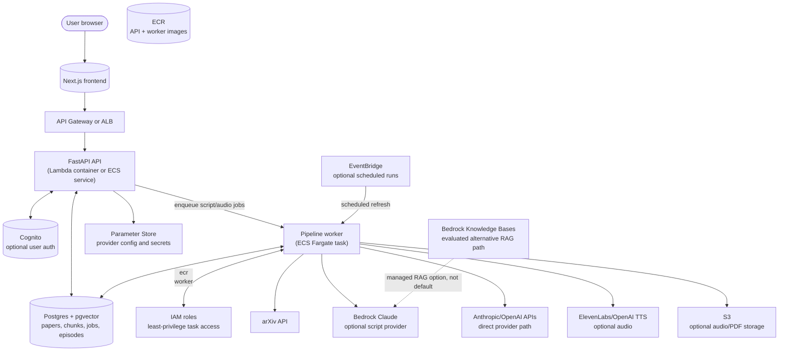

# Neuropod

Neuropod turns recent arXiv papers into citation-grounded, audio-ready research scripts. Users set research topics and optional arXiv categories; the system discovers papers, extracts sections from PDFs, chunks and embeds the text, retrieves relevant context, and generates a 6-9 minute narrated script. Audio is a separate optional step: after a script exists, the app can synthesize TTS audio and attach it to the episode/feed.

The project is designed as an AI engineering portfolio system, not a permanently hosted SaaS. It runs locally without API keys in demo mode, and the repo includes Docker plus an AWS reference architecture/IaC scaffold for interview discussion.

## Tech Stack

- **Backend**: Python, FastAPI, APScheduler-ready job model
- **Pipeline**: arXiv API, PyMuPDF section extraction, section-aware chunking, tiktoken token accounting, OpenAI embeddings or deterministic hash fallback, Anthropic/OpenAI/Bedrock-compatible script generation
- **Retrieval**: in-process dense/sparse retriever today; Postgres + pgvector HNSW schema included for production retrieval
- **Audio**: optional ElevenLabs/OpenAI TTS after script generation; demo fallback emits a short WAV tone
- **Frontend**: Next.js 16 App Router, TypeScript, plain CSS
- **Storage**: SQLite for zero-cost local runs; Postgres + pgvector schema for production
- **Telemetry**: per-call `llm_calls` ledger (exact tokens + cost) and `retrieval_traces` (which chunks grounded each script)
- **Container**: Docker / docker-compose

## Running It

Two ways: Docker (recommended — single command, everything wired) or local Python + Node.

### Docker (recommended)

You need Docker Desktop running.

**First time setup:**

```bash
git clone https://github.com/alvinn6o/Neuropod-Research-Paper-Podcasts.git
cd Neuropod-Research-Paper-Podcasts
cp .env.example .env
```

**Start it:**

```bash
docker-compose up --build -d
```

Open http://localhost:3000.

**Daily commands:**

```bash
# Start (no rebuild — fast)
docker-compose up -d

# Restart after pulling code changes (rebuilds API/worker images)
docker-compose down && docker-compose up --build -d

# Watch logs live
docker-compose logs -f api

# Stop everything (keeps your DB + episodes)
docker-compose down

# Nuke everything including users + episodes
docker-compose down -v
```

**Verify it's up:**

```bash
curl http://localhost:8000/healthz
```

Should print `{"status":"ok"}`.

### Local (no Docker)

You need Python 3.11+ and Node 20+ on your machine.

**First time setup:**

```bash
git clone https://github.com/alvinn6o/Neuropod-Research-Paper-Podcasts.git
cd Neuropod-Research-Paper-Podcasts

cp .env.example .env
pip install -r requirements.txt
cd frontend && npm install && cd ..
```

**Run it (two terminals):**

```bash
# Terminal 1 — API
python -m uvicorn api.main:app --reload --port 8000
```

```bash
# Terminal 2 — frontend
cd frontend && npm run dev
```

Open http://localhost:3000. Postgres is optional locally — the app falls back to a SQLite file at `data/neuropod.sqlite3` if `NEUROPOD_DATABASE_URL` is empty.

### Useful one-liners

```bash
# Run the test suite (~1s, no API calls)
make test

# Type-check the frontend
make typecheck

# Remove any duplicate episodes (one-shot cleanup)
make dedupe

# Run the optional LLM-as-judge eval (costs API credits, requires OPENAI_API_KEY)
make eval
```

## API Keys

The app works without keys. Demo mode uses seeded papers, deterministic embeddings, fallback script generation, and optional demo audio.

Add provider keys to `.env` when you want real model/audio calls:

```bash
ANTHROPIC_API_KEY=              # script generation, preferred direct provider
OPENAI_API_KEY=                 # embeddings, script fallback, TTS fallback
ELEVENLABS_API_KEY=             # optional higher-quality narration
NEUROPOD_LIVE_DISCOVERY=true    # fetch live arXiv papers instead of demo catalog
```

Audio is intentionally not part of the default pipeline run:

```bash
NEUROPOD_GENERATE_AUDIO_ON_PIPELINE=false
```

Use the UI's episode page, `POST /episodes/{id}/audio`, or `python scripts/run_pipeline.py --with-audio` when you want TTS generated.

This portfolio build uses operator-level provider keys from environment variables. It does not include an in-app user BYOK key vault.

## Reference AWS Architecture

This repo is not currently deployed to AWS. The AWS path is documented and scaffolded so the architecture can be discussed and redeployed later without keeping idle resources running.



Why pgvector instead of keeping Bedrock Knowledge Bases live: Knowledge Bases depend on OpenSearch Serverless, which has an idle cost floor. For a portfolio system, Postgres + pgvector keeps local and production paths cheaper while still demonstrating vector retrieval design. Bedrock Knowledge Bases remain a reasonable enterprise alternative if the managed ingestion/retrieval workflow is worth the cost.

See [infra/aws/README.md](infra/aws/README.md) for the AWS service mapping and [infra/aws/terraform](infra/aws/terraform) for a non-applied Terraform scaffold.

## How It Works

1. Pulls candidate papers from arXiv filtered to user topics, arXiv categories, and a discovery window.
2. Scores papers by recency, topic affinity, citation signal, and prior listening feedback.
3. Extracts PDF sections with PyMuPDF, chunks each section, and embeds chunks.
4. Retrieves relevant chunks and sends them to the script writer with a grounded prompt.
5. Persists the generated script, paper metadata, chunks, QA status, and estimated runtime.
6. Optionally synthesizes TTS audio for an existing script and stores the audio on disk or S3.
7. RSS feed items include audio enclosures only for episodes with generated audio.

Follow-up Q&A uses the same indexed paper chunks and returns citation excerpts under each answer.

## Evaluation

The retriever has a checked-in benchmark fixture for the Mamba paper (`arXiv:2312.00752`):

```bash
pytest tests/test_recall.py -q -s
```

Results, with the caveats that matter:

| Metric | Value | 95% CI (Wilson) |
|---|---|---|
| recall@1 | 58.3% (7/12) | 32.0% – 80.7% |
| recall@5 | 83.3% (10/12) | 55.2% – 95.3% |
| recall@10 | 83.3% (10/12) | 55.2% – 95.3% |
| MRR | 0.692 | — |

**What these numbers do and do not show.** Two things have to be said plainly:

1. **They measure the `HashEmbedder` path, not the shipping path.** The fixture
   was built with the deterministic SHA256 bag-of-words fallback
   (`embedder_backend` in `tests/fixtures/mamba_meta.json`), which is what runs
   when no `OPENAI_API_KEY` is set. That is a hashing scheme, not a semantic
   embedding. Real OpenAI embeddings are untested here. Regenerate with
   `OPENAI_API_KEY=... python -m eval.precompute_fixtures` to measure the path
   that actually ships.
2. **n = 12 queries on 1 paper is too small to detect a change.** The interval
   on recall@1 spans 32%–81%. A retrieval change worth 10 points cannot be
   distinguished from noise at this sample size, which makes any A/B comparison
   against this fixture unfalsifiable. The fix is more papers and more queries,
   not a better retriever.

Both are being addressed by the evaluation work in the roadmap; the numbers are
published with their intervals in the meantime rather than quoted bare.

The full deterministic test suite covers API smoke tests, auth/session behavior,
topic/category CRUD, chunking invariants, retriever behavior, embedding-space
and spend-cap invariants, QA heuristics, and the script-first/audio-optional
episode flow.

```bash
pytest tests/ -q
```

## Cost Controls

This is a demo, and generation costs real money, so spend is bounded in four
independent places rather than one:

| Control | Default | Env var |
|---|---|---|
| Episodes per click | 5 | — (`MAX_EPISODES_PER_RUN`) |
| Per-user runs/day | 20 | `NEUROPOD_DAILY_PIPELINE_LIMIT` |
| **Global runs/day (all users)** | 60 | `NEUROPOD_GLOBAL_DAILY_RUN_LIMIT` |
| **Monthly USD ceiling** | $5.00 | `NEUROPOD_MONTHLY_BUDGET_USD` |
| **Daily USD ceiling** | $1.00 | `NEUROPOD_DAILY_BUDGET_USD` |

The global and USD caps exist because the per-user caps are not a spend bound on
their own: `POST /auth/stub/login` mints a persistent identity for any email
with no verification, so a per-user quota is free to reset by making a new
account. At Sonnet prices one identity running its cap is roughly $5/day.

Spend is measured, not estimated. Every provider call writes a row to
`llm_calls` with exact token counts from the response's `usage` block and a cost
derived from the pricing table in `pipeline/usage.py`. Current spend against the
caps is visible at `GET /status` under `budget`, and a per-model rollup for the
month is under `spend` when authenticated.

**Exceeding a USD cap degrades, it does not error.** Script generation falls
back to the zero-cost template and `/ask` falls back to deterministic metadata
answers, so the site still works — it just stops spending. Affected episodes are
recorded with `llm_provider = "demo-budget"` so the degradation is visible in
the data rather than silent. The global run cap is the one control that
rejects (429), because a run that cannot call a model would just fill a feed
with template scripts.

These are defence in depth, not the last line. **Set a spend cap at the provider
too** (Anthropic workspace limits, OpenAI project budgets) — that is the only
ceiling a bug in this repo cannot bypass.

## Layout

```text
api/                FastAPI app, routes, DB helpers, audio storage
pipeline/
  discover/         arXiv client, ranker, affinity, citation-signal interface
  ingest/           PDF extraction, section-aware chunking
  generate/         Embedders, retriever, script writer, QA
  synthesize/       Optional TTS providers and audio helpers
frontend/
  src/app/          Next.js pages
  src/components/   UI components: player, chat, topic editor, command palette
db/schema.sql       Postgres + pgvector schema
eval/               Recall fixture generation and optional LLM-as-judge eval
infra/aws/          AWS reference architecture and Terraform scaffold
scripts/            CLI helpers
```

## Interview Positioning

The accurate one-liner:

> Neuropod is a script-first RAG system for tracking research papers: it discovers arXiv papers, extracts and chunks PDFs, benchmarks retrieval on a real paper, generates grounded narrated scripts, and can optionally synthesize podcast audio. I have not kept it deployed on AWS, but I designed the AWS path around ECS/Fargate, ECR, IAM roles, Parameter Store, S3, Bedrock Claude, and an evaluated Bedrock Knowledge Bases alternative.

## Keyboard Shortcuts

- `Space` - play / pause
- `J` or `Left Arrow` - back 15 seconds
- `L` or `Right Arrow` - forward 30 seconds
- `Cmd+K` or `/` - open command palette
- `?` - show shortcuts overlay

Click the speed indicator on the player (`1x`) to cycle through 0.85x -> 1x -> 1.25x -> 1.5x -> 1.75x -> 2x.

## License

MIT
